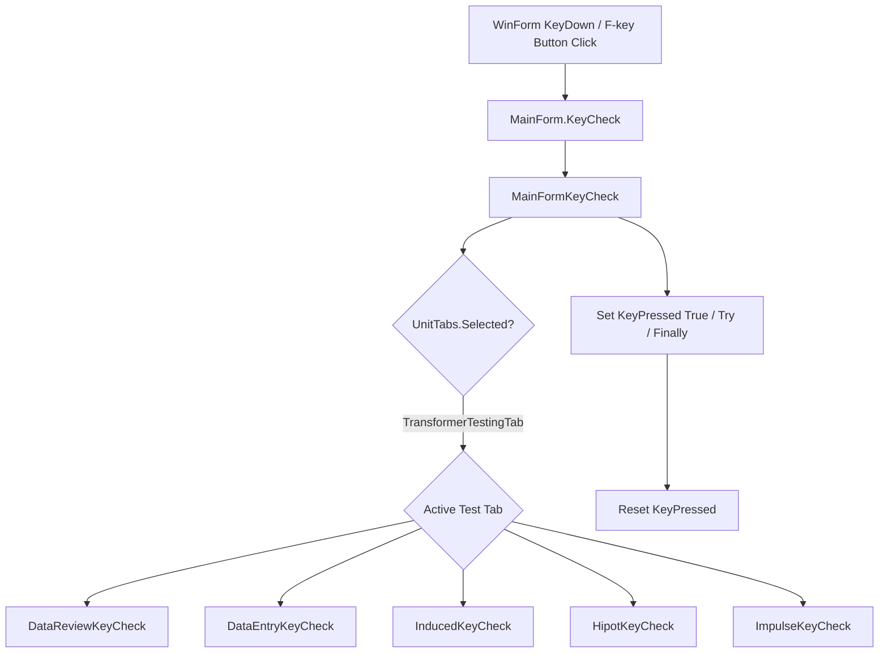
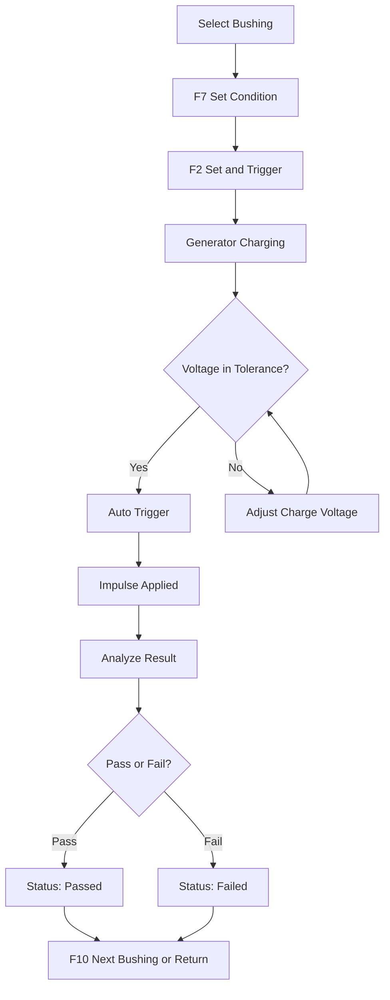
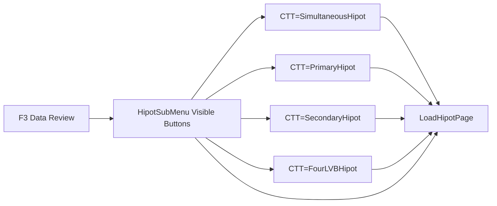
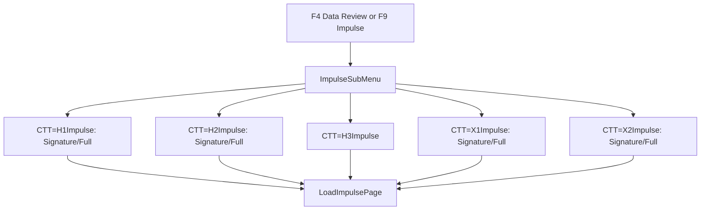
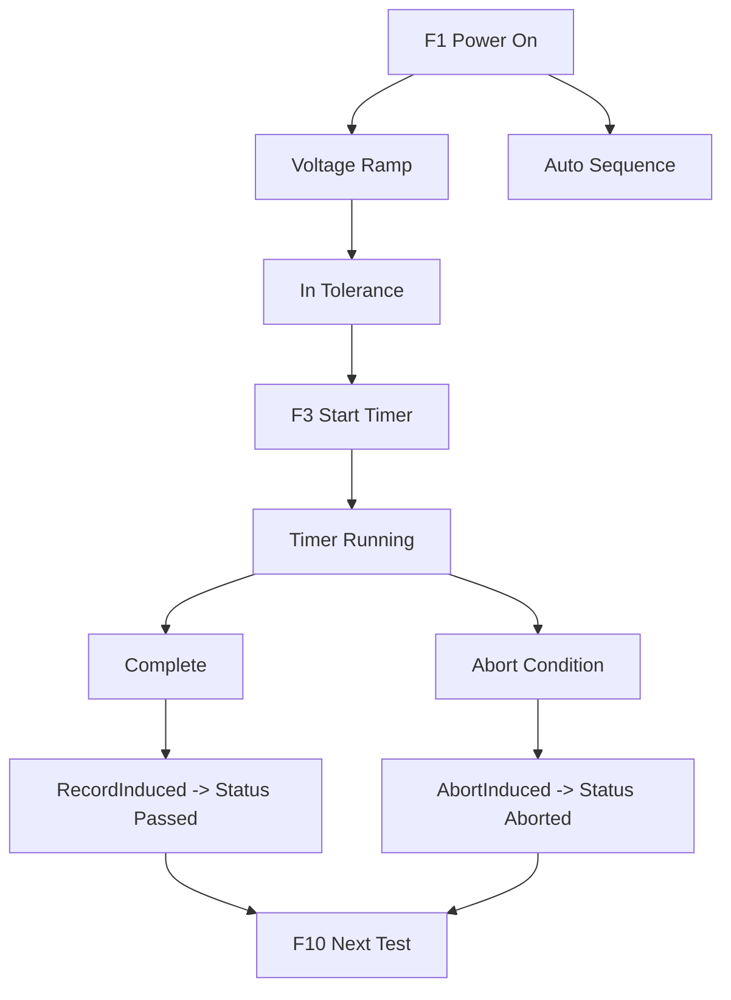
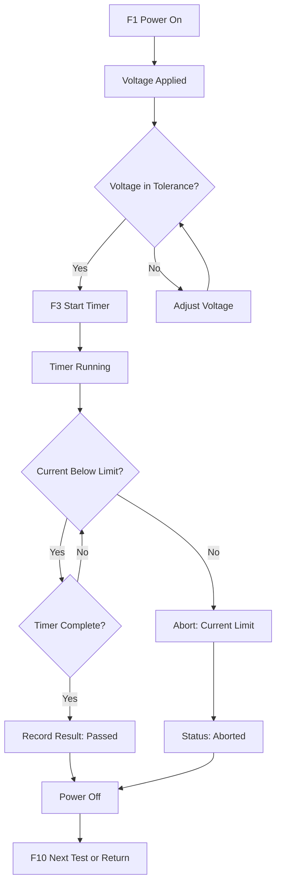
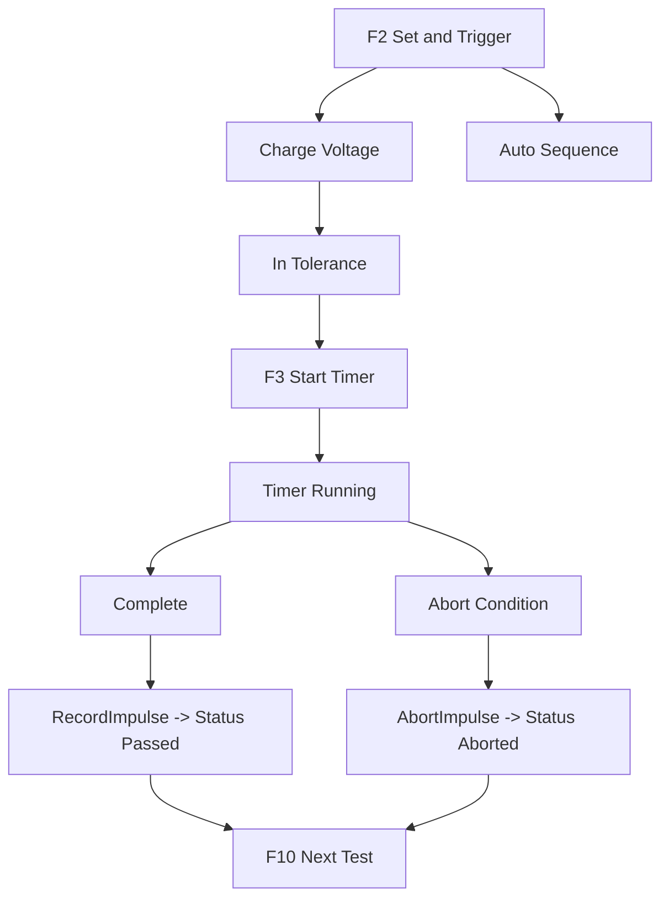
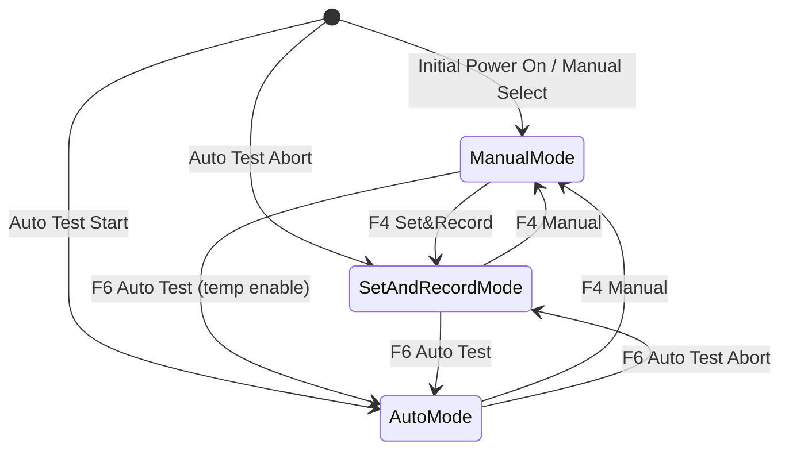
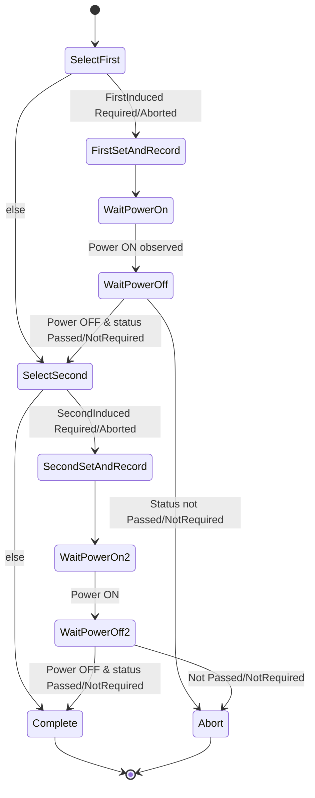
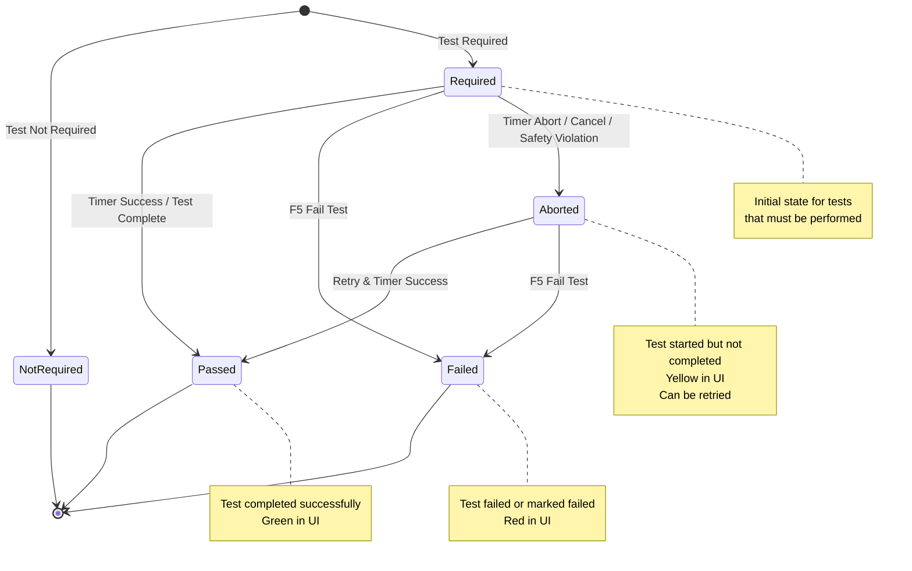

# Function Key Behavior Reference (Escape, F1–F10)

This document describes context–sensitive actions and UI side effects for each function key across the Transformer Testing application.

## Table of Contents

1. [Global Key Processing Flow](#1-global-key-processing-flow)
2. [Tab–Specific Function Key Matrix](#2-tabspecific-function-key-matrix)
   - [Data Review Tab](#21-data-review-tab)
   - [Data Entry Tab](#22-data-entry-tab)
   - [Induced Tab](#23-induced-tab)
   - [Hipot Tab](#24-hipot-tab)
   - [Impulse Tab](#25-impulse-tab)
3. [Test Selection Workflows](#3-test-selection-workflows)
   - [Hipot Test Selection Submenu Flow](#31-hipot-test-selection-submenu-flow)
   - [Impulse Bushing Selection](#32-impulse-bushing-selection)
4. [Test Execution Flows](#4-test-execution-flows)
   - [Induced Key Interaction](#41-induced-key-interaction)
   - [Hipot Test Interaction](#42-hipot-test-interaction)
   - [Impulse Test Interaction](#43-impulse-test-interaction)
5. [Mode & Status Management](#5-mode--status-management)
   - [Mode Toggle State Machine](#51-mode-toggle-state-machine)
   - [Auto Test State Machine](#52-auto-test-state-machine)
   - [Status Transition State Diagram](#53-status-transition-state-diagram)
6. [Shared Side Effects Summary](#6-shared-side-effects-summary)
7. [Visual Feedback & UI Indicators](#7-visual-feedback--ui-indicators)
8. [Safety & Abort Integration](#8-safety--abort-integration)
9. [Developer Notes](#9-developer-notes)

> **Legend:**
> - **CT** = Current Test (CurrentUnit.CurrentTest)
> - **CTT** = TestStation.CurrentTestType
> - **Mode** = TestStation.Mode (Manual | SetAndRecord | Auto)
> - **Power** = TestStation.Power (On | Off)
> - **Req?** = Corresponding test status == Required/Aborted (still pending)
> - **Lists** = Tab listviews (Recorded / Params)

---
## 1. Global Key Processing Flow



`UpdateDisplay_Tick` continuously (250 ms) re-evaluates enablement, labels, highlighting, and visibility; handlers execute only if their button is Enabled at press time.

---
## 2. Tab–Specific Function Key Matrix

### 2.1 Data Review Tab

| Key | Action                                            | Preconditions                                         | Side Effects                                                  |
|-----|---------------------------------------------------|:------------------------------------------------------|---------------------------------------------------------------|
| Esc | (None – label says Return to Menu but no handler) | —                                                     | —                                                             |
| F1  | Load Data Entry page                              | Unit downloaded                                       | Calls `LoadDataEntryPage`, clears MsgDisplay, switches tab    |
| F2  | Open First Induced page                           | First Induced Req?                                    | Sets CTT=FirstInduced; sets tests required; `LoadInducedPage` |
| F3  | Hipot selection submenu                           | Any Hipot test offerable & First Induced not required | Launch `HipotSubMenu`; on OK sets CTT; loads Hipot page       |
| F4  | Impulse selection submenu                         | Any Impulse test offerable & upstream tests done      | (Menu analogous to Hipot) sets CTT; `LoadImpulsePage`         |
| F5  | Open Second Induced page                          | Second Induced offerable & upstream tests complete    | Sets CTT=SecondInduced; loads induced page                    |
| F6  | Auto Test toggle (currently forced disabled)      | (Logic present but button disabled)                   | Would set Mode=Auto, start AutoTestTimer                      |
| F7  | Operator ID dialog                                | —                                                     | Resets operator/supervisor globals; shows `OperatorIDEntry`   |
| F8  | Upload results                                    | Queue operation                                       | Calls `Upload()`                                              |
| F9  | Reprint Fail Tag                                  | `TestStation.PrinterPath` not empty                   | Recreates `FailureData` and `Reprint()`                       |
| F10 | Cycle CT (wrap)                                   | TotalTests>1                                          | Updates CT; DataReview view highlights new test               |

Enable logic enforced by `UpdateDisplay_Tick` based on required statuses ordering (must do First Induced before Hipot before Impulse before Second Induced).

### 2.2 Data Entry Tab

| Key    | Action                                                                | Preconditions               | Side Effects                                                                                              |
|--------|-----------------------------------------------------------------------|-----------------------------|-----------------------------------------------------------------------------------------------------------|
| Esc    | Return to Data Review (after optional check number validation & save) | Valid check (or default SN) | Commits pending changes; `LoadTransformerTestingPage`                                                     |
| F1     | Download / Refresh unit                                               | Serial field populated      | Calls `Download(sn)` and reloads fields                                                                   |
| F9     | Clear Unit Data                                                       | Confirmation accepted       | Writes partial data (if not default),  reinitializes `CurrentUnit`, reloads screen, clears recorded views |
| F10    | Next test record fields                                               | TotalTests>1                | Loads rating/status fields for next CT; updates internal indices                                          |
| Others | —                                                                     | —                           | Disabled                                                                                                  |

### 2.3 Induced Tab

| Key | Action                                  | Preconditions                                      | Side Effects                                                                                    |
|-----|-----------------------------------------|----------------------------------------------------|-------------------------------------------------------------------------------------------------|
| Esc | Return to Data Review (power off first) | —                                                  | If Power On → `InducedTestPowerOff`; load review                                                |
| F1  | Toggle Test Power                       | Mode=Manual or SetAndRecord; F1 Enabled            | On -> Off: `InducedTestPowerOff`. Off -> On: `InducedTestPowerOn` (+enable raise/lower buttons) |
| F2  | Set and Record / Cancel                 | SetAndRecord Mode OR Auto path                     | Off: calls `InducedSetAndRecord` (label->Cancel). On: cancels (power off)                       |
| F3  | Start Timer (First or Second)           | Manual Mode, Power On, Voltage in tolerance window | Calls `InducedTimerOn`; starts appropriate timer; monitors abort/passes                         |
| F4  | Mode Toggle (Manual ↔ SetAndRecord)     | Power Off                                          | Adjusts Mode & button set (dynamic label)                                                       |
| F5  | Fail Test                               | Enabled based on mode/power                        | Marks current induced segment Failed (`FailTest`), refreshes recorded list                      |
| F7  | Change Set Condition                    | Power Off                                          | Sets `g_SetConditionType=Voltage`; shows dialog; resets lead IO                                 |
| F8  | Change Voltage Range                    | Power Off                                          | Shows `VoltageRangeForm`; resets switching IO                                                   |
| F9  | Change Current Range                    | Power Off                                          | Shows `CurrentRangeForm`                                                                        |
| F10 | Next Test                               | Power Off; Multiple tests                          | Advances CT; sets ranges; re-applies lead switching                                             |

Voltage Tolerance Visual: Meter voltage label(s) turn Yellow (inside inner band) enabling F3; transparent when outside outer band (disabling F3). Three-phase replicates logic per channel.

### 2.4 Hipot Tab

| Key | Action                              | Preconditions                       | Side Effects                                                             |
|-----|-------------------------------------|-------------------------------------|--------------------------------------------------------------------------|
| Esc | Return to Data Review (power off)   | —                                   | If Power On: `HipotTestPowerOff`                                         |
| F1  | Toggle Test Power                   | Mode Manual/SetAndRecord            | Switches test supply (Primary/Secondary/Simultaneous context)            |
| F2  | Set and Record / Cancel             | Mode SetAndRecord                   | Power Off: `HipotSetAndRecord`; Power On: cancel & power off             |
| F3  | Start/Stop Timer(s)                 | Power On; Timers not active         | Starts or stops Primary and/or Secondary/FourLVB timers depending on CTT |
| F4  | Mode Toggle (Manual ↔ SetAndRecord) | Power Off                           | Adjust control group enablement & label                                  |
| F5  | Fail Test                           | Power Off (or allowed state)        | Sets status Failed (one/both sides as per CTT) and reloads recorded data |
| F7  | Change Set Condition                | Not Simultaneous or after power off | Sets `g_SetConditionType=kVoltage`; dialog opens                         |
| F9  | Change Test (submenu)               | >1 Hipot test required              | Launch `HipotSubMenu`; load selected test page                           |
| F10 | Next Test                           | Power Off; multiple tests           | Cycles CT & highlights row                                               |

Timers enforce: voltage within ±(HIPOT_TOLERANCE*2) during run, current below limit. Out-of-range abort -> status Aborted + power off cascade.

### 2.5 Impulse Tab

| Key | Action                    | Preconditions                   | Side Effects                                                                                     |
|-----|---------------------------|---------------------------------|--------------------------------------------------------------------------------------------------|
| Esc | Return to Data Review     | Power On: stop generator        | `ImpulseGen.Stop`; load review                                                                   |
| F2  | Set and Trigger / Cancel  | Safety OK; appropriate statuses | Power Off: `ImpulseSetAndTrigger` (enables test). Power On: cancel: disable enable output + stop |
| F5  | Fail Current Bushing Test | Allowed (Power Off state)       | Marks matching bushing Failed; refresh list                                                      |
| F7  | Change Set Condition      | —                               | `g_SetConditionType=kVoltage`; dialog; may alter forthcoming triggers                            |
| F9  | Change Bushing (submenu)  | >1 required impulse bushing     | Launch ImpulseSubMenu; set CTT; reload impulse page                                              |
| F10 | Next Test                 | Multiple tests                  | Advance CT; highlight recalculated row                                                           |

While testing: F2 label changes to Cancel; F5/F7/F9/F10 disabled until test completes (Power Off). Charge voltage label turns Yellow inside test tolerance band.

#### Impulse Test Interaction Flow



---
## 3. Test Selection Workflows

### 3.1 Hipot Test Selection Submenu Flow



Availability rules (`HipotSubMenu_Load`):
- Primary shown if required count > 0.
- Secondary shown if required count > 0.
- Simultaneous shown only if both Primary & Secondary enabled and NOT 3-phase (`Is3Phase` false).
- 4LVB shown if required count > 0.
- Auto-select if exactly 1 option.

### 3.2 Impulse Bushing Selection

(Implementation analogous; class not shown; diagram inferred.)



Required statuses drive visibility; signature vs full chosen inside submenu sets exact enum value before load.

---
## 4. Test Execution Flows

### 4.1 Induced Key Interaction



### 4.2 Hipot Test Interaction



### 4.3 Impulse Test Interaction



---
## 5. Mode & Status Management

### 5.1 Mode Toggle State Machine



### 5.2 Auto Test State Machine



On completion returns to Data Review (Mode forced back to SetAndRecord). Failure at any step aborts Auto and reports step number.

### 5.3 Status Transition State Diagram



#### Status Transition Details

| Action                                     | Status Field Affected          | Transition                            |
|--------------------------------------------|--------------------------------|---------------------------------------|
| Timer success (Induced First/Second)       | `FirstStatus` / `SecondStatus` | Required/Aborted → Passed             |
| Timer abort (range / power loss)           | Same                           | Required → Aborted                    |
| F5 Fail Test                               | Context test status            | Any non-final → Failed                |
| Cancel during Set&Record (power off early) | Induced/Hipot current segment  | Required → Aborted                    |
| Impulse completion (external result)       | Bushing status                 | Required → Passed/Failed (per result) |

**Key Points:**
- **Aborted** tests can be retried - they return to **Required** state until successfully completed
- **Failed** and **Passed** are terminal states - manual intervention required to change
- **NotRequired** tests are skipped entirely and don't appear in workflows

---
## 6. Shared Side Effects Summary

| Category          | Triggering Keys                                 | Effects                                                                    |
|-------------------|-------------------------------------------------|----------------------------------------------------------------------------|
| Power Toggle      | F1 (Induced/Hipot), F2 Cancel branches          | Updates Power state; may stop timers; resets UI enablement                 |
| Mode Toggle       | F4                                              | Recomputes which keys are enabled; alters labels (Manual ↔ Set and Record) |
| Timer Start       | F3 (Induced/Hipot) or HV/LV SetCondition events | Starts *TestTime tracking; periodic abort/passing logic                    |
| Fail Mark         | F5 (test tabs)                                  | Sets status=Failed; recolors list rows (Red)                               |
| Navigation        | F1/F2–F5 Data Review, F10 test tabs             | Sets CT or CTT; reloads pages; highlights active list row LightBlue        |
| Configuration     | F7–F9 (Induced), F7 (Hipot/Impulse)             | Updates set condition / range fields and IO switching                      |
| Upload            | F8 (Data Review)                                | Enqueues result files (queue monitoring separate)                          |
| Identity          | F7 (Data Review)                                | Resets operator/supervisor globals & tooltip                               |
| Submenu Selection | F3 (Hipot), F4 (Impulse), F9 (Hipot/Impulse)    | Sets CTT; influences enabled elements & timer grouping                     |

---
## 7. Visual Feedback & UI Indicators

| Element                                | Color / Change         | Meaning                                  |
|----------------------------------------|------------------------|------------------------------------------|
| Voltage labels (Induced/Hipot/Impulse) | Yellow                 | Set condition inside test tolerance band |
| Recorded status cell                   | Green / Red / Yellow   | Passed / Failed / Aborted                |
| Current Test row                       | LightBlue background   | Active CT                                |
| Impulse connection label               | Green / Red            | Connected / Disconnected                 |
| Test Power indicators                  | Red (On) / Green (Off) | Live power state                         |
| Operator ID tooltip                    | Updated text           | After F7 Data Review                     |

---
## 8. Safety & Abort Integration

- POD timer asynchronously enforces safety (System Enable, over-voltage/current, hardware ready signals)
- On violation: sets corresponding status to Aborted, powers down sources, grounds outputs, and disables conflicting keys until recovery.

---
## 9. Developer Notes

### Current Limitations

- **Escape on Data Review:** Label says "Return to Menu" but no handler is implemented
- **F6 Auto Test:** Functionality exists but button is permanently disabled in UI
- **Auto Test Scope:** Currently constrained to induced tests only (First and Second)

### Implementation Patterns

**Submenu Auto-Selection:**
When only one test option is available (e.g., only Primary Hipot required), the submenu automatically selects it and loads the test page. This simplifies operator workflow and reduces unnecessary clicks.

**Lead Switching IO Reset Pattern (Induced Tests F7–F9):**
```
Power Off → Dialog Change (Range/Condition) → Power On(Sense)
```
This pattern ensures proper IO state after configuration changes.

**UpdateDisplay_Tick Pattern:**
The 250ms timer continuously re-evaluates all function key states. This ensures UI stays synchronized with application state without requiring manual refresh calls. All enable logic should be in UpdateDisplay, not in individual handlers.

### Key Processing Flow

1. **KeyDown Event** or **Button Click** triggers `MainForm.KeyCheck`
2. **MainFormKeyCheck** sets `KeyPressed = true` in try block
3. Routes to appropriate tab-specific handler based on active tab
4. Handler executes action **only if button is currently Enabled**
5. Finally block ensures `KeyPressed` is reset to `false`

This pattern prevents key repeat issues and ensures state consistency.

### Future Enhancements

1. Implement Escape handler for Data Review tab
2. Enable F6 Auto Test for full test sequence (not just induced)
3. Add user preference for auto-select behavior in submenus
4. Consider adding confirmation dialogs for destructive actions (F9 Clear Unit Data)

### Testing Considerations

- Test all key combinations with different Mode/Power states
- Verify enable logic across all tabs with various test configurations
- Validate status transitions cover all edge cases
- Ensure abort and safety sequences execute correctly under all conditions
- Test with single and multi-test configurations

---
## Quick Reference: Common Key Sequences

### Starting a New Unit
1. **Data Review:** F1 → Data Entry
2. **Data Entry:** Enter serial, F1 Download
3. **Data Entry:** Esc → Data Review
4. **Data Review:** F2 → First Induced Test

### Running an Induced Test (Manual Mode)
1. Ensure Mode = Manual (F4 to toggle if needed)
2. F1 Power On
3. Adjust voltage until label turns Yellow
4. F3 Start Timer
5. Wait for completion or abort
6. Esc to return to Data Review

### Running an Induced Test (Set and Record Mode)
1. Ensure Mode = Set and Record (F4 to toggle if needed)
2. F2 Set and Record
3. System automatically executes test
4. F2 to cancel if needed
5. Esc to return after completion

### Navigating Test Sequence
1. **Data Review → First Induced:** F2
2. **Data Review → Hipot:** F3 (submenu if multiple options)
3. **Data Review → Impulse:** F4 (submenu if multiple bushings)
4. **Data Review → Second Induced:** F5
5. **Data Review → Upload:** F8

### Handling Test Failures
1. Note failure reason
2. F5 to explicitly mark as Failed (if appropriate)
3. Or retry by re-entering test page
4. Update test configuration if needed (F7-F9)

---
**End of Document**
